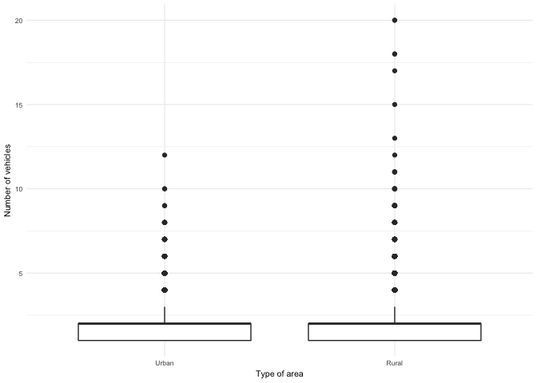
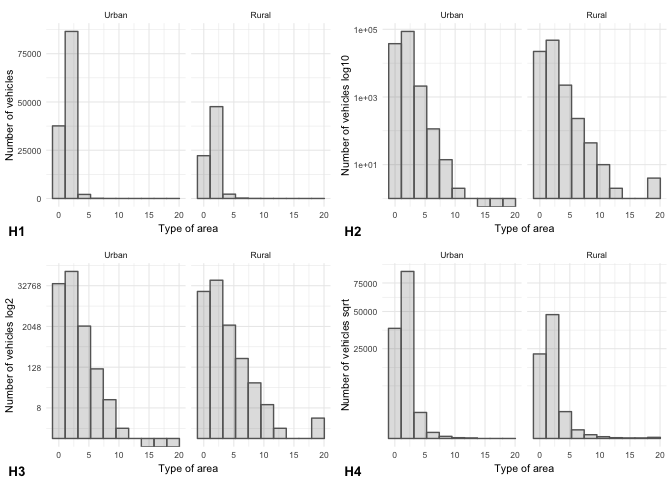
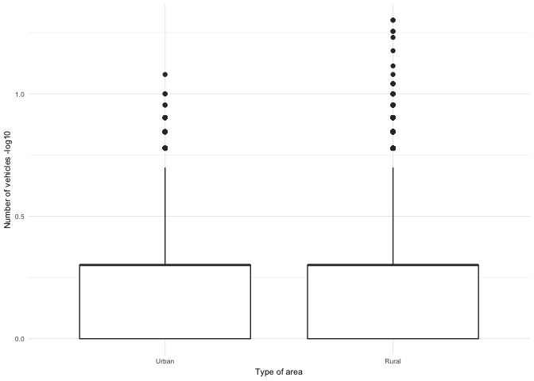
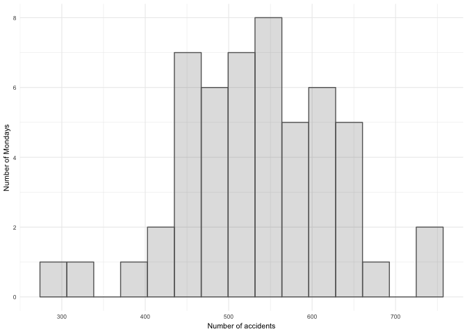

Data Analysis and Statistical Inference using R
================
Student ID: 201081646

Introduction
============

This report is the second assessment of the **MATH5741M Statistical Theory and Methods** module. Its aim is to answer statistically three questions regarding a road traffic accidents dataset from 2005 collected by the UK Department for Transport.

All the analysis has been done using **R** (programming language) and is code reproducible. To see the complete **R** coding process and outputs visit <https://github.com/eugenividal/Data_Analysis_and_Statistical_Inference_using_R>.

Results
=======

Question 1
----------

<!--(1)Draw a boxplot to compare the number of vehicles involved in an urban area, with the number involved in a rural area. (2) Explain why a transformation of the data may (or may not) be appropriate. Using your transformation (or not) (3) carry out a suitable test to investigate whether the average number of vehicles in an accident differs in urban and rural areas.-->
In this question, we are asked to draw a boxplot to compare the number of vehicles involved in urban areas with the number involved in rural areas.

<!--http://www.jbstatistics.com/pooled-variance-t-tests-and-confidence-intervals-an-example/-->
For this, we first prepare the data removing "Unallocated" values from the `Urban_or_Rural Area` variable. Then, we plot the graph.

Number of vehicles involved in accidents grouped by type of area

Apart from the fact that rural areas have more outliers than urban areas, in the boxplot we cannot appreciate the differences between their quantiles. Both boxes look identical and the median and upper quartile seem to be coincident.

This is because the data is not symmetrical. As we can see in histogram H1 (Figure 2), the data is very skewed to the right. To normalise it, we transform the `Number_of_Vehicles` variable in three different ways: taking the log10, log2 and using the square root (see histograms, H2, H3 and H4 in Figure 2). In these new histograms, the distribution is not entirely symmetric, but they have improved, particularly those that take log10 and log2.

Data histogram (H1) and transformed data histograms (H2, H3, H4)

We choose the log10 transformation, which looks closer to normal distribution, and draw a second boxpot.

Number of vehicles (log10) involved in accidents grouped by type of area

This time the appearance of the boxplot is better, with bigger boxes. However, the interpretation is still hard, and we cannot be 100% sure whether the average number of vehicles involved in accidents differs per type of area.

To investigate this, we carry out a statistical test, which is the second requirement of the question. The null hypothesis is that the mean of vehicles involved in both types of areas is equal. The alternative hypothesis is that they differ. Denoting the rural areas by subscript *r* and urban by subscript *u*, we have:

*H*0 : *μ**u* = *μ**r*   *v**s*.   *H*1 : *μ**u* ≠ *μ**r*

We will use a critical region approach with *α* = 0.01.

The summary statistics are:

$$n\_{u}=126378\\;\\;\\bar{x\_{u}}=0.2305898\\;\\;s\_{u}^{2}=0.1622405\\;\\;n\_{r}=72267\\;\\;\\bar{x\_{r}}=0.2389048\\;\\;s\_{r}^{2}=0.1775904$$

<!--Case in p.78.-->
It seems reasonable to assume *σ**u*2 = *σ**r*2. Consequently, we apply a **pooled standard deviation** for our estimates[1].

$$s\_{p}^{2}=\\frac{(n\_{u}-1)s\_{u}^{2}+(n\_{r}-1)s\_{r}^{2}}{n\_{u}+n\_{r}-2} = \\frac{126377\*0.02632197984+72266\*0.03153835017}{126378+72267-2}=0.0282197$$

The test statistic is then:

$$\\frac{\\bar x\_{u}-\\bar x\_{r}-0}{s\_{p}\\sqrt{\\frac{1}{n\_{u}}+\\frac{1}{n\_{r}}}}=\\frac{0.2389048-0.2305898}{0.0001316089}=-0.001374182$$

We compare this to the critical point of t-distribution with *ν* = 198,643 degrees of freedom[2], which is *t*198643(0.005)=2.575854. Since |0.001374182| &lt; 2.575854, we do not reject the null hypothesis and conclude that the mean of vehicles involved in both types of areas is equal (*μ**u* = *μ**r*).

Question 2
----------

<!--Using a suitable statistical hypothesis test, investigate whether the frequency of accidents varies by day of the week. Repeat this test using only week-days (excuding Saturday and Sunday)

http://www.jbstatistics.com/chi-square-tests-for-one-way-tables/
The key is that we want to test the frequency. p.91..-->
In this question, we have to investigate whether the frequency of accidents varies by day of the week using a suitable statistical hypothesis test. **Chi-square test** can be used to test whether observed data differ significantly from theoretical expectations (Lane 2018). So, this is the test we apply.

The null hypothesis is that the frequency of accidents is evenly distributed per days of the week (i.e. the probability of accidents occurring per each day is 1/7). The alternative hypothesis is that their frequency differs (i.e. the probability of accidents occurring per each day is not 1/7).

*H*0 : *p* = 1/7   *v**s*.   *H*1 : *p* ≠ 1/7 

To carry out this test, first, we prepare the data, aggregating it by `Day_of_Week`. Secondly, we create a table with the observed values, the expected values and other necessary contributions for the test per day of week.

|  week days|  observed|  expected|     oi - ei|  (oi - ei)^2/ei|
|----------:|---------:|---------:|-----------:|---------------:|
|     Monday|     27812|  28390.71|    578.7143|        11.79647|
|    Tuesday|     29219|  28390.71|   -828.2857|        24.16485|
|  Wednesday|     30373|  28390.71|  -1982.2857|       138.40640|
|   Thursday|     29738|  28390.71|  -1347.2857|        63.93565|
|     Friday|     32738|  28390.71|  -4347.2857|       665.67163|
|   Saturday|     26945|  28390.71|   1445.7143|        73.61878|
|     Sunday|     21910|  28390.71|   6480.7143|      1479.34487|

The value of *χ*2 = 2456.93865. This can be compared to the *χ*2 distribution with 7 - 1 = 6 degrees of freedom, giving a p-value of 2.2e-16. This p-value represents the probability that we are wrong in the assumption they are basically not equally distributed. So, we reject the null hypothesis and affirm that the frequency of accidents is not evenly distributed per days of the week (*p* ≠ 1/7).

Next, we are required to do the same test using only week-days (excluding Saturday and Sunday).

This time the null hypothesis is that the frequency of accidents is equally distributed per week days (i.e. the probability of accidents per each week day is 1/5). The alternative hypothesis is that their frequency differs (i.e. the probability of accidents per each week day is not 1/5).

*H*0 : *p* = 1/5   *v**s*.   *H*1 : *p* ≠ 1/5 

First, we prepare the data, aggregating it by `Day_of_Week` and removing Saturday and Sundays. Then, we create a new table with the summaries from Monday to Friday.

|  week days|  observed|  expected|  oi - ei|  (oi - ei)^2/ei|
|----------:|---------:|---------:|--------:|---------------:|
|     Monday|     27812|     29976|     2164|      156.221510|
|    Tuesday|     29219|     29976|      757|       19.116927|
|  Wednesday|     30373|     29976|     -397|        5.257840|
|   Thursday|     29738|     29976|      238|        1.889645|
|     Friday|     32738|     29976|    -2762|      254.491727|

The value of *χ*2 = 436.9776. This is compared to the *χ*2 distribution with 5-1=4 degree of freedom, giving a p-value again of 2.2e-16. So, again we reject the null hypothesis and state that the frequency of accidents in week days is not equally distributed (*p* ≠ 1/5).

Question 3
----------

<!--Compute a 95% confidence interval for the expected (mean) number of accidents which occur on a Monday. State your assumptions in computing this interval, and verify whether they are valid.-->
Finally, we are asked to compute a 95% confidence interval for the expected (mean) number of accidents which occur on a Monday.

To prepare the data, we filter the accidents occurred on Mondays and group them by date.

In total we get 52 observations (*n* = 52). The sample mean and variance are: $\\bar{x}$= 534.8462 and *s*2= 92.98627 respectively. Since we desire a 95% interval, our *α*= 0.05. We then find that *t*51(0.025)= 2.007584.

Substituting all these quantities into the form of the confidence interval, we have the 95% confidence interval for the expected number of accidents on a Monday.

$$\\left ( \\bar{x} -t\_{n-1}(\\alpha /2)\\frac{s}{\\sqrt{n}}, \\bar{x} +t\_{n-1}(\\alpha /2)\\frac{s}{\\sqrt{n}}\\right) = (534.8462-25.88754,\\; 534.8462+25.88754) = 508.9586, 560.7337 $$

Computing this interval, we state the assumption that the data are normally distributed. An informal approach to check that this assumption is reasonable, is to compare a histogram (or another kind of graph) of the sample data to a normal probability curve, as we did in question 1.

Histogram number of accidents which occur on a Monday

The histogram does not show perfect symmetry, but its shape is close to normal distribution.

However, to be more certain, there are various formal hypothesis tests to check normality that can be used. The one that we will perform here is the **Shapiro-Wilk test**, which takes account of the expected values, but also the correlations between the order statistics (Taylor 2017, 85).

These are the hypothesis:

*H*0 : *d**a**t**a* *c**o**m**e* *f**r**o**m* *a* *n**o**r**m**a**l* *d**i**s**t**r**i**b**u**t**i**o**n*   *v**s*.   *H*1 : *d**a**t**a* *d**o* *n**o**t* *c**o**m**e* *f**r**o**m* *a* *n**o**r**m**a**l* *d**i**s**t**r**i**b**u**t**i**o**n*

We perform Shapiro-Wilk test of normality using the command `shapiro.test(x)` in **R**.

The results are W = 0.98537 and p-value = 0.7681.

The p-values gives evidence against the null hypothesis. Since the p-value = 0.7681 is large (i.e. greater than 0.05), we accept that the data come from a normally distributed population.

References
==========

Lane, David M. 2018. “Online Statistics Education: An Interactive Multimedia Course of Study.” <http://onlinestatbook.com/>.

Taylor, Charles. 2017. “MATH5741M: Statistical Theory and Methods.” School of Mathematics - University of Leeds.

[1] We can assume equal variances when the ratio of max/min is less than 3 or less than 4 for small samples (Taylor 2017, 69).

[2] With this number of degrees of freedom we could have also apply z-statistic and the result would have been nearly the same.
