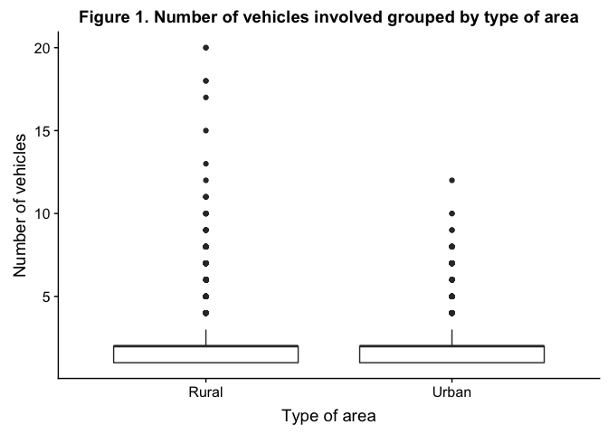
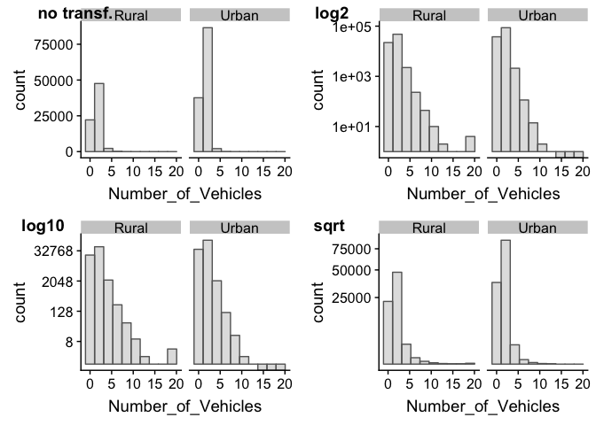
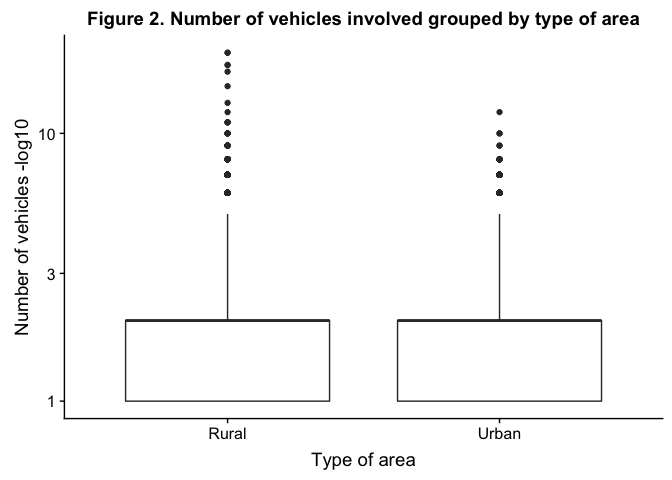

Road Traffic Accidents Data Analysis using R
================
Student ID: 201081646

Introduction
============

This report is the second assessment of the **MATH5741M Statistical Theory and Methods** module. Its aim is to analyse a road traffic accidents dataset collected by the UK Department for Transport (DfT) in 2005 trough different statistical methods such as boxplot visualisations, statistical hypothesis testing, and confidence intervals.

It has been done using **R** (programming language) and it is code reproducible. To see the whole code written for its performance visit <https://github.com/eugenividal/Road-Traffic-Accidents-Data-Analysis>

Data preparation
================

First, we activate the libraries we will need to set up the project.

``` r
# Activate libraries
library(ggplot2)
library(cowplot)
```

Second, we load the data into the **R** environment.

``` r
# Read csv in R
#xx=read.csv("http://www1.maths.leeds.ac.uk/~charles/math5741/DfTaccidents.csv",header=T)
xx=read.csv("DfTaccidents.csv", header=T)
```

The next step is to drop all those columns we will not need to perform our analysis. We only need: number of vehicles, type of area and day of the week.

Finally, we show the the dataset ready for exploration.

``` r
# Show first 6 rows
head(xx)
```

    ##   Number_of_Vehicles Day_of_Week Urban_or_Rural_Area
    ## 1                  1           3                   1
    ## 2                  1           4                   1
    ## 3                  2           5                   1
    ## 4                  1           6                   1
    ## 5                  1           2                   1
    ## 6                  2           3                   1

Data exploration
================

Boxplot
-------

<!--(1)Draw a boxplot to compare the number of vehicles involved in an urban area, with the number involved in a rural area. (2) Explain why a transformation of the data may (or may not) be appropriate. Using your transformation (or not) (3) carry out a suitable test to investigate whether the average number of vehicles in an accident differs in urban and rural areas.-->
The following boxplot compares the number of vehicles involved in accidents in urban areas with the number involved in a rural areas.

The boxplot withouht transformation show us that the data is not symetric, it is, in fact, very skewed to the left - The median and the 3rdQu are the same: 2.

To perform this graph we transforme the data in order to: - make the relationship beween x and y more linear - make skewed distributions more symmetric Otherwise, it was very difficult to apreciate what was actually going on.

What kind of transformatin we apply? <http://onlinestatbook.com/2/transformations/contents.html>



    ##    Min. 1st Qu.  Median    Mean 3rd Qu.    Max. 
    ##   1.000   1.000   2.000   1.843   2.000  20.000

    ##    Min. 1st Qu.  Median    Mean 3rd Qu.    Max. 
    ##  0.0000  0.0000  1.0000  0.7761  1.0000  4.3219

    ##    Min. 1st Qu.  Median    Mean 3rd Qu.    Max. 
    ##  0.0000  0.0000  0.3010  0.2336  0.3010  1.3010

    ##    Min. 1st Qu.  Median    Mean 3rd Qu.    Max. 
    ##   1.000   1.000   1.414   1.333   1.414   4.472



<https://www.youtube.com/watch?v=5571wc0iWCI> As it can be seen, in the urban areas...

A x test has been carried out to investigate whether the average number of vehicles in an accident differ in urban and rural areas.

``` r
# Test to investigate whether the average number of vehicles differes per areas
```

As we can see, the...

Statistical hypothesis
----------------------

<!--Using a suitable statistical hypothesis test, investigate whether the frequency of accidents varies by day of the week. Repeat this test using only week-days (excuding Saturday and Sunday).-->
In this section, we investigate whether the frequency of accidents varies by day of the week. To do this we use a statistical hypotesis test.

This time the test is done using only week-days (excluding Saturday and Sunday).

Confidence interval
-------------------

<!--Compute a 95% confidence interval for the expected (mean) number of accidents which occur on a Monday. State your assumptions in computing this interval, and verify whether they are valid.-->
Finally, in this section, we compute a 95% confidence interval for the expected (mean) number of accidents which occur on a Monday.

Bibliography
------------

The resources used to carry out this project are:

-   Balka, J. 2013. JBStatistics: Making Statistics Make Sense. Available from: <http://www.jbstatistics.com>.
-   Lane, D.M. 2018. Online Statistics Education: An Interactive Multimedia Course of Study. Available from: <http://onlinestatbook.com/>.
-   Taylor, C. 2017. MATH5741M: Statistical Theory and Methods. Outline Lecture Notes.
-   Yau, C. 2018. R tutorial: an R introduction to statistics. Available from: <http://www.r-tutor.com>
