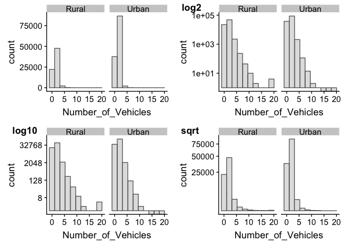
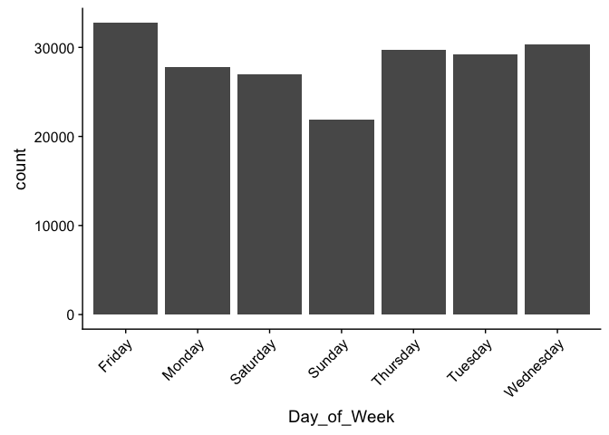
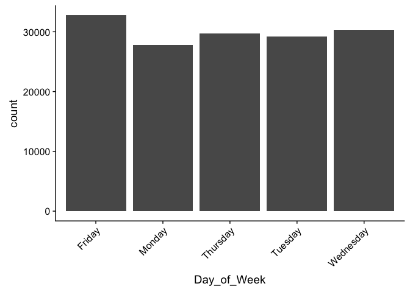

Road Traffic Accidents Data Analysis using R
================
Student ID: 201081646

Introduction
============

This report is the second assessment of the **MATH5741M Statistical Theory and Methods** module. Its aim is to analyse a road traffic accidents dataset collected by the UK Department for Transport (DfT) in 2005 trough different statistical methods such as boxplot visualisations, statistical hypothesis testing, and confidence intervals.

It has been done using **R** (programming language) and it is code reproducible. To see the whole code written for its performance visit <https://github.com/eugenividal/Road-Traffic-Accidents-Data-Analysis>

Data preparation
================

First, we activate the libraries we will need to set up the project.

``` r
# Activate libraries
library(tidyverse)
library(cowplot)
```

Second, we load the data into the **R** environment.

``` r
# Read csv in R
#xx=read.csv("http://www1.maths.leeds.ac.uk/~charles/math5741/DfTaccidents.csv", header =T)
xx=read.csv("DfTaccidents.csv", header=T)
```

The next step is to drop all those columns we will not need to perform our analysis. We only need: number of vehicles, type of area and day of the week.

Then, we transform the variables

``` r
# Rename labels of Urban_or_Rural_Area
xx$Urban_or_Rural_Area[xx$Urban_or_Rural_Area == "1"] <- "Urban"
xx$Urban_or_Rural_Area[xx$Urban_or_Rural_Area == "2"] <- "Rural"
xx$Urban_or_Rural_Area[xx$Urban_or_Rural_Area == "3"] <- "Unallocated"

# Rename labels of day of the week
xx$Day_of_Week[xx$Day_of_Week == "1"] <- "Sunday"
xx$Day_of_Week[xx$Day_of_Week == "2"] <- "Monday"
xx$Day_of_Week[xx$Day_of_Week == "3"] <- "Tuesday"
xx$Day_of_Week[xx$Day_of_Week == "4"] <- "Wednesday"
xx$Day_of_Week[xx$Day_of_Week == "5"] <- "Thursday"
xx$Day_of_Week[xx$Day_of_Week == "6"] <- "Friday"
xx$Day_of_Week[xx$Day_of_Week == "7"] <- "Saturday"

#xx$Day_of_Week  <- factor(xx$Day_of_Week , levels= c("Sunday", "Monday", 
#    "Tuesday", "Wednesday", "Thursday", "Friday", "Saturday"))
```

Finally, we show the the dataset ready for exploration.

``` r
# Show first 6 rows
head(xx)
```

    ##   Number_of_Vehicles Day_of_Week Urban_or_Rural_Area
    ## 1                  1     Tuesday               Urban
    ## 2                  1   Wednesday               Urban
    ## 3                  2    Thursday               Urban
    ## 4                  1      Friday               Urban
    ## 5                  1      Monday               Urban
    ## 6                  2     Tuesday               Urban

Data exploration
================

Boxplot
-------

<!--(1)Draw a boxplot to compare the number of vehicles involved in an urban area, with the number involved in a rural area. (2) Explain why a transformation of the data may (or may not) be appropriate. Using your transformation (or not) (3) carry out a suitable test to investigate whether the average number of vehicles in an accident differs in urban and rural areas.-->
To compare the number of vehicles involved in urban areas with the number involved in a rural areas, we plot a boxplot. However, the graph is not very clear. To check what might be the problem, we plot a histogram. The data is not symetric, it is very skewed to the left (see histogram 1). To normalise it, I first plot three different transformations: log2, log10 and sqrt. Then, I chose log10 to plot the boxplot again.


    ##    Min. 1st Qu.  Median    Mean 3rd Qu.    Max. 
    ##   1.000   1.000   2.000   1.843   2.000  20.000

    ##    Min. 1st Qu.  Median    Mean 3rd Qu.    Max. 
    ##  0.0000  0.0000  1.0000  0.7761  1.0000  4.3219

    ##    Min. 1st Qu.  Median    Mean 3rd Qu.    Max. 
    ##  0.0000  0.0000  0.3010  0.2336  0.3010  1.3010

    ##    Min. 1st Qu.  Median    Mean 3rd Qu.    Max. 
    ##   1.000   1.000   1.414   1.333   1.414   4.472



However, from the boxplot we can not whether the average number of vehicles in an accident differ in urban and rural areas. To do this, we perform a test.

?chisq.test

This is the same as exercise C4 too.

<https://statistics.laerd.com/statistical-guides/independent-t-test-statistical-guide.php>

These are two-tailed tests of population mean with unknown variance. Pooled variance test?

*H*<sub>0</sub> : *μ*<sub>*u*</sub> = *μ*<sub>*r*</sub>   *v**s*.   *H*<sub>1</sub> : *μ*<sub>*u*</sub> ≠ *μ*<sub>*r*</sub>

``` r
# Check the variance of the two groups
xx_area$log10 <- log10(xx_area$Number_of_Vehicles)
Urban_or_Rural_Area <- xx_area$Urban_or_Rural_Area
var(xx_area[Urban_or_Rural_Area=="Urban",4])        # apply the var function 
```

    ## [1] 0.02632199

``` r
var(xx_area[Urban_or_Rural_Area=="Rural",4])
```

    ## [1] 0.03153835

They are not about the same, should we continue with a two sample test which assumes equal variance? The independent t-test assumes the variances of the two groups you are measuring are equal in the population. If your variances are unequal, this can affect the Type I error rate. The assumption of homogeneity of variance can be tested using Levene's Test of Equality of Variances.

``` r
# pooled variance test
#t.test(xx[])
```

In conclusion, we can say that

Statistical hypothesis
----------------------

<!--Using a suitable statistical hypothesis test, investigate whether the frequency of accidents varies by day of the week. Repeat this test using only week-days (excuding Saturday and Sunday).-->
Comparing frequency counts between two groups of different sample.

Chi-squared test?

In this section, we investigate whether the frequency of accidents varies by day of the week. To do this we use a statistical hypotesis test.

\*Note that here the unallocated accidents are included.

``` r
# hypothesis per each day
ggplot(xx, aes(x=Day_of_Week))+geom_bar() +
  theme(axis.text.x = element_text(angle = 45, hjust=1))
```



Next, we are asked to do the same test using only week-days (excluding Saturday and Sunday).

``` r
# Select data using only week-days
week_days <- xx%>%
  select(Day_of_Week)%>%
  filter(!Day_of_Week %in% c("Saturday", "Sunday"))
```

    ## Warning: package 'bindrcpp' was built under R version 3.4.4

``` r
table(week_days)
```

    ## week_days
    ##    Friday    Monday  Thursday   Tuesday Wednesday 
    ##     32738     27812     29738     29219     30373

``` r
ggplot(week_days, aes(x=Day_of_Week))+geom_bar() +
  theme(axis.text.x = element_text(angle = 45, hjust=1)) 
```



``` r
# hypothesis per each day using only week-days
```

Confidence interval
-------------------

<!--Compute a 95% confidence interval for the expected (mean) number of accidents which occur on a Monday. State your assumptions in computing this interval, and verify whether they are valid.-->
Finally, in this section, we compute a 95% confidence interval for the expected (mean) number of accidents which occur on a Monday.

``` r
# Select data using only week-days
week_days<- xx%>%
  select(Day_of_Week)%>%
  filter(Day_of_Week == "Monday")
```

Bibliography
------------

The resources used to carry out this project are:

-   Balka, J. 2013. JBStatistics: Making Statistics Make Sense. Available from: <http://www.jbstatistics.com>.
-   Lane, D.M. 2018. Online Statistics Education: An Interactive Multimedia Course of Study. Available from: <http://onlinestatbook.com/>.
-   Taylor, C. 2017. MATH5741M: Statistical Theory and Methods. Outline Lecture Notes.
-   Yau, C. 2018. R tutorial: an R introduction to statistics. Available from: <http://www.r-tutor.com>
